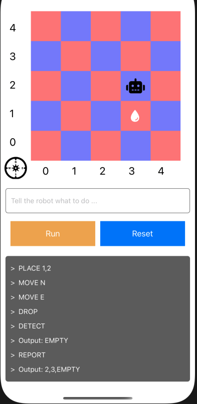

# Robot Puzzle

### Project Structure

```
src/
├── components/ basic components for global
├── config/ constants and config file for project
├── pages/ page for the project
│ ├── simulator
│       ├── components component for the simulator
├── store/ use redux to store data shared by project
├── utils/ utility function for global project
└── App.js the entry of the app
```

## Getting Started
- Git
- React Native
- Node(Yarn or Npm)
- Xcode && Simulator or Android Env && Simulator

### Installation
1. git clone https://github.com/JohnyXu/RobotPuzzle.git
2. `yarn` to install the dependencies

## Run locally

Please guarantee the iOS or Android Env is ok.

1. run android simulator by typing `yarn android` in the root project.
2. run ios simulator: `yarn ios`
3. run test cases: `yarn test`

## Screen



1. input data below and then enter or click Run button:
2. reset button will reset the data in memory
```
PLACE 1,2
MOVE N
MOVE E
REPORT
```